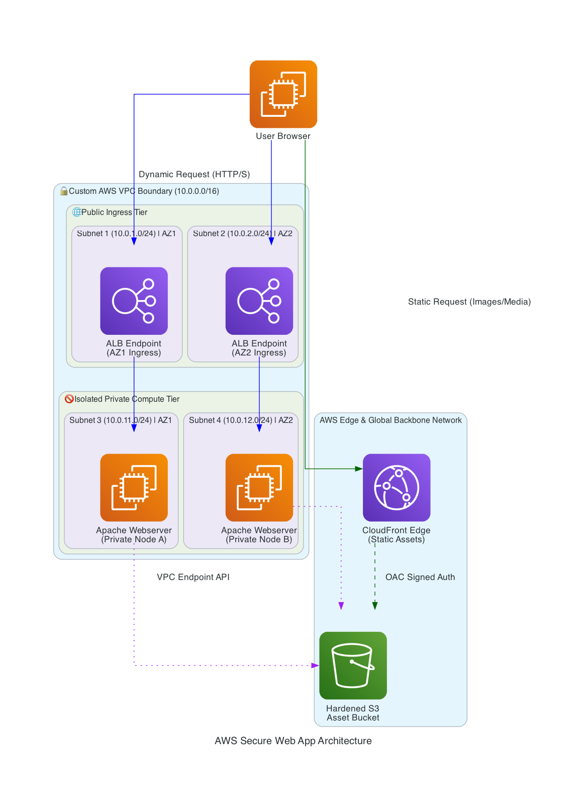
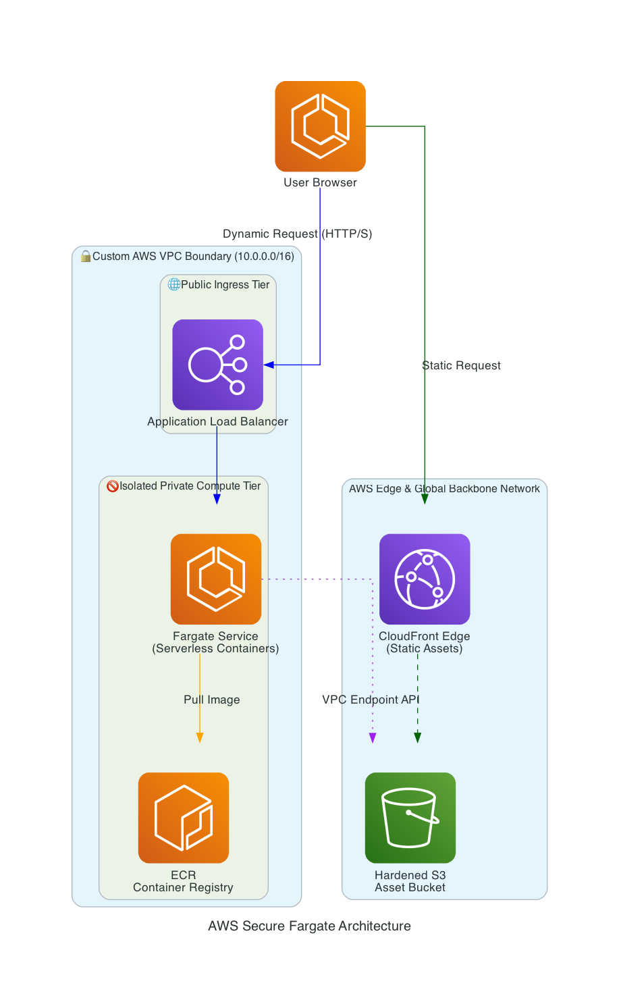

# Secure Global Media Delivery & Multi-Tier Cloud Architecture

## 📌 Project Overview
This repository contains production-grade, modular cloud infrastructure on AWS. Originally engineered using traditional virtual machines, the project has been deliberately modernized into a fully containerized, serverless architecture. 

The infrastructure is explicitly designed around the **Principle of Least Privilege** and **Defense in Depth**, ensuring that backend compute assets are entirely isolated from the public internet while static assets are globally optimized.

---

## 🚀 Architecture Evolution (The Migration Story)

To mirror real-world enterprise engineering decisions, this project evolved through two distinct phases to optimize scalability and eliminate operational maintenance overhead.

### Phase 1: Legacy Multi-Tier Design (EC2)
Initially, the web application was deployed on custom Apache web servers across isolated private subnets using EC2 instances. While highly secure, this pattern required manual OS patching, complex scaling policies, and raw server management.

### Phase 2: Modernized Serverless Container Architecture (ECS/Fargate) — *Current*
To eliminate server management and optimize resource allocation, the architecture was migrated to a cloud-native containerized platform. Compute resources are now dynamically spun up on-demand as isolated tasks across availability zones.

---

## 🛠️ Core Architectural Features

### 🐳 Container Registry & Serverless Compute (New)
* **Amazon ECR:** Serves as a private, secure Docker container registry where the production web application image is version-controlled and hosted.
* **AWS Fargate & ECS:** Replaced static EC2 instances with serverless container orchestration. Tasks run dynamically in isolated private subnets, pulling configurations securely from ECR and scaling seamlessly without underlying EC2 management.

### 🌐 Global Content Delivery & Security Edge
* **Amazon CloudFront:** Serves as the public-facing edge network, providing low-latency caching at global edge locations and handling centralized SSL/TLS termination.
* **Origin Access Control (OAC):** Static media assets (`/images/*`) are locked down inside a private Amazon S3 bucket. All direct public S3 URLs are disabled; the bucket is hardened to **only** accept traffic signed by the CloudFront Service Principal.

### 🔒 Strict Network Isolation (VPC Design)
The network topology is split across a multi-AZ layout in the `ap-southeast-1` (Singapore) region to ensure high availability:
* **Public Tier:** Houses a public-facing Application Load Balancer (ALB) distributing traffic across multiple AZs. This is the *only* entry point exposed to the internet.
* **Private Tier:** Completely isolates the Fargate container tasks. They have **no public IP addresses** and cannot be reached directly from the internet.

### 🚀 Internal Routing & Cost Optimization
* **S3 VPC Gateway Endpoint:** Instead of forcing private containers to route out to the public internet to download assets from S3, traffic is routed through an internal Gateway Endpoint, keeping data entirely within the secure AWS backbone network.

---

## 🧰 Tools & Technologies
* **Infrastructure Layer:** AWS (VPC, Fargate, ECS, ECR, S3, CloudFront, ALB, IAM).
* **Containerization:** Docker for application packaging.
* **Documentation-as-Code:** Python (`diagrams` library) to programmatically generate and version-control architectural blueprints.

---

## 🔒 Security Hardening Highlights (The "Why")
1. **Immutable Container Deployments:** Moving to Docker/Fargate eliminates configuration drift. Servers are never patched or altered in place; updates are deployed by pushing a new immutable image to ECR.
2. **Dynamic IAM Task Execution:** Instead of static credentials, Fargate tasks utilize short-lived IAM Task Execution roles to pull images from ECR and securely stream logs to Amazon CloudWatch.
3. **Asymmetric Security Groups:** The private Fargate compute tier utilizes strict ingress rules that *only* accept traffic originating specifically from the security group of the Application Load Balancer.
