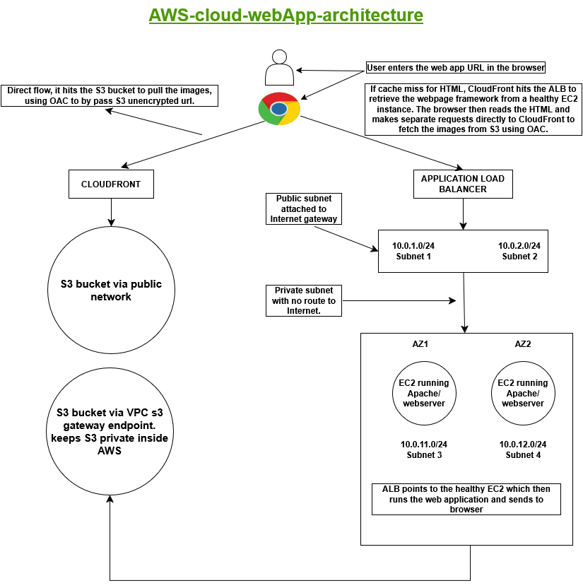

# AWS 2-Tier Secure Web Application Architecture

A production-ready infrastructure-as-code project using Terraform to deploy a highly secure, high-availability 2-tier web application on AWS.

## Architecture Topology

## Core Architectural Features

* **Global Content Delivery**: Fronted by Amazon CloudFront to ensure low-latency edge caching and SSL/TLS termination.
* **Secure Asset Management**: Media assets (`/images/*`) are strictly served out of a private Amazon S3 bucket protected via **Origin Access Control (OAC)**.
* **Network Isolation (VPC)**: 
  * **Public Tier**: Houses the Application Load Balancer (ALB) across two Availability Zones to securely intercept public internet requests.
  * **Private Tier**: Completely isolates backend EC2 instances running Apache web servers with no direct public internet route or public IPs.
* **Internal Routing Efficiency**: Configured an internal **S3 VPC Gateway Endpoint** allowing the private EC2 instances to safely communicate with S3 entirely within the AWS backbone network.

## Tools Used
* **Terraform** (Infrastructure as Code)
* **AWS** (Cloud Infrastructure)
* **Draw.io** (Architectural Design)
